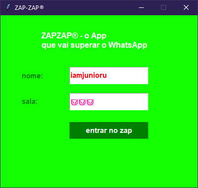
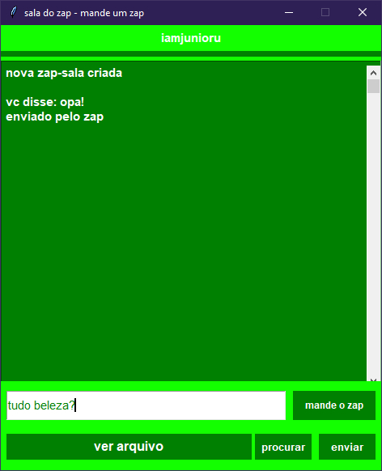

<!-- header -->
<div id="top"></div>
<div align="center">
  <br>
  <br>
  <a href="https://github.com/iamjunioru/zapzap-chat">
    
  </a>
  

  <h3 align="center">★ zapzap - o app que vai superar o wh4tsapp ★</h3>

  <p align="center">
    <i>memechat</i> feito pro projeto final da disciplina sistemas distribuídos.<br>
    feito com Socket e GUI Tkinter. <br>
    
```
$ pip install r- requirements.txt
```
  </p>
</div>

---

 <div align="center">
<h3 align="center">★ visual revolucionário do zapzap ★</h3>
  <br>
   <br> tela de login 😎 <br> <br>
   <br> tela de conversa 😎 <br>   
 <br>
 
---
  
  <div id="bottom"></div>
    <br>
     feito com :heart: por <a href="https://github.com/iamjunioru">junior</a>.
    <p>
      <br>
  
